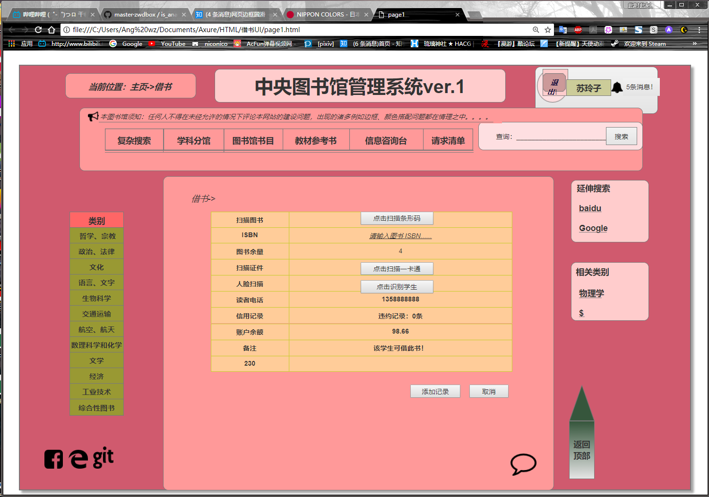

# 实验5：图书管理系统数据库设计与界面设计
|学号|班级|姓名|
|:-------:|:-------------: | :----------:|
|201510414316|软工2015-3|王壮|

## 1.数据库表设计

## 1.1. 图书表
|字段|类型|主键，外键|可以为空|默认值|说明|
|:-------:|:-------------:|:------:|:----:|:---:|:----:|
|ISBN|char(13)|主键|否|7-309-04547-5|必须11位|
|BName|varchar(15)| 外键|否|NULL|与借书表相关联|
|BNumber|int(6)| |是|5|可借图书数量|
|BType|varchar(10)| |是|科学|所属分类|
|Author|char(8)| |是|NULL||
|Price|float(10)| |是|0||
|Pubcomp|varchar(20)| |是|NULL|出版社|
|Pubdate|date(11)| |否|NULL|出版日期|

## 1.2. 读者表
|字段|类型|主键，外键|可以为空|默认值|说明|
|:-------:|:-------------:|:------:|:----:|:---:|:----:|
|Rid|char(12)|主键|否|201510414316|小于12位的编号|
|Password|varchar(15)| |否|123456|6-15位的密码|
|RName|int(6)|外键 |否|NULL|与借阅表相关联|
|Sex|char(2)| |否|男||
|ReaderType|varchar(10)| |是|学生||
|Tel|varchar(15)| |是|+86 13588888888||
|Email|varchar(15)| |否|angwz@qq.com||

## 1.3. 管理员表
|字段|类型|主键，外键|可以为空|默认值|说明|
|:-------:|:-------------:|:------:|:----:|:---:|:----:|
|Mid|char(12)|主键|否|110-02|小于12位的编号|
|Password|varchar(15)| |否|123456|6-15位的密码|
|Tel|varchar(15)| |否|13588888888||
|ManagerType|varchar(10)| | 否|NO.2|系统管理员/图书管理员|
|Mname|varchar(6)| |否|张三||
|Age|int(2)| |是|NULL|任职年限|

## 1.4. 借阅表
|字段|类型|主键，外键|可以为空|默认值|说明|
|:-------:|:-------------:|:------:|:----:|:---:|:----:|
|no|char(12)| |否|0001|自增编号|
|Rname|varchar(15)| 主键|否|张三|与Bname复合主键|
|BName|varchar(15)| 主键|否|信息系统设计|与Rname复合主键|
|BorrowDate|Date(11)| | 否|2018-05-05|借书日期|
|ReturnDate|Date(11)| |否|2018-05-06|归还日期|
|Mid|char(12)| |否|NULL|操作人编号|

## 1.5. 罚款表
|字段|类型|主键，外键|可以为空|默认值|说明|
|:-------:|:-------------:|:------:|:----:|:---:|:----:|
|no|char(12)| 主键|否|0001|自增编号|
|Bno|char(12)| 外键|否|0001|与借阅表的no相关联|
|Rname|varchar(15)| |否|张三||
|ISvalid|char(2)| |否|FALSE|是否缴纳罚款|
|BorrowDate|Date(11)| | 否|2018-05-05|借书日期|
|TReturnDate|Date(11)| |否|2018-05-07|实际归还日期|

## 2. 界面设计
## 2.1. 借书界面设计


*说明：添加图书可扫描和手动输入ISBN，两者任选即可；添加读者信息也是两者选一。

- 用例图参见：借书用例
- 类图参见：借书类，读者类
- 顺序图参见：借书顺序图
- API接口如下：

1. 获取图书信息

- 功能：获取图书信息
- 请求地址： http://BookManager/v1/api/books
- 请求方法：POST
- 请求参数：

| 参数名称       | 必填  | 说明 |
|:--------------|:-----|:-------|
| access_token | 是    | 用于验证请求合法性的认证信息 |
|method       |是     |固定为GET|
|version      |是     |客户端版本号|
|resource_name| 否|图书名称|
|author|否|作者|      
|publish_house|否|出版社|
|publish_year|否|年份|
|type|否|图书类型|
|ISBN|否|图书ISBN编号|

- 返回实例：
```
{
    "info": "查找成功",
    "data": {
        "resource_name": "网站的色调和字体",
        "author": "未知",
        "publish_house": "四川科学出版社",
        "publish_date": "2018年5月",
        "type": "艺术-感官",
        "resource_introduction": "网站设计一直是个难点",
        "resource_have_number": "0",
        "status": "借空"
    },
    "code": 100
}
```
- 返回参数说明：
    
|参数名称|说明|
|:-------:|:-------------: |
|Info|返回信息|
|data|图书信息|
|dodo|返回码|

2. 获取读者信息

- 功能：获取读者信息
- 请求地址： http://BookManager/v1/api/readers
- 请求方法：POST
- 请求参数：

| 参数名称       | 必填  | 说明 |
|:--------------|:-----|:-------|
| access_token | 是    | 用于验证请求合法性的认证信息 |
|method       |是     |固定为GET|
|version      |是     |客户端版本号|
|reader_name| 否|读者名称|
|reader_id|否|读者号|      

- 返回实例：
```
{
    "info": "查找成功",
    "data": {
        "reader_name": "村上春树",
        "reader_id": "201520162018",
    },
    "code": 100
}
```
- 返回参数说明：
    
|参数名称|说明|
|:-------:|:-------------: |
|Info|返回信息|
|data|读者信息|
|dodo|返回码|
