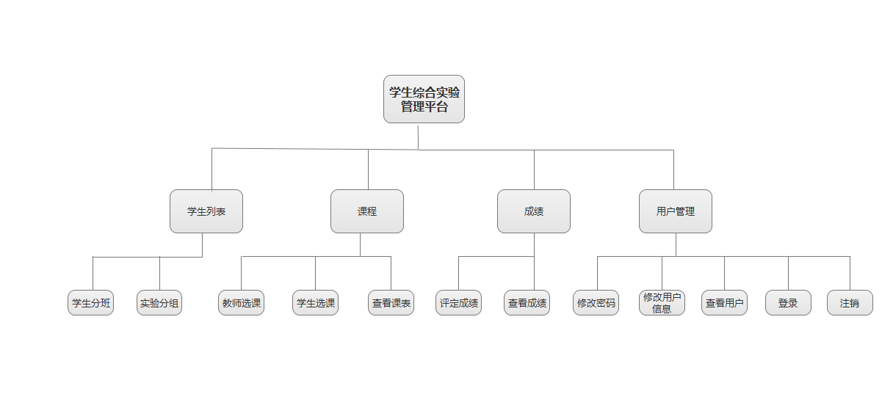
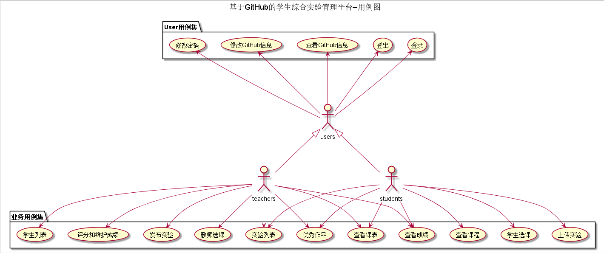
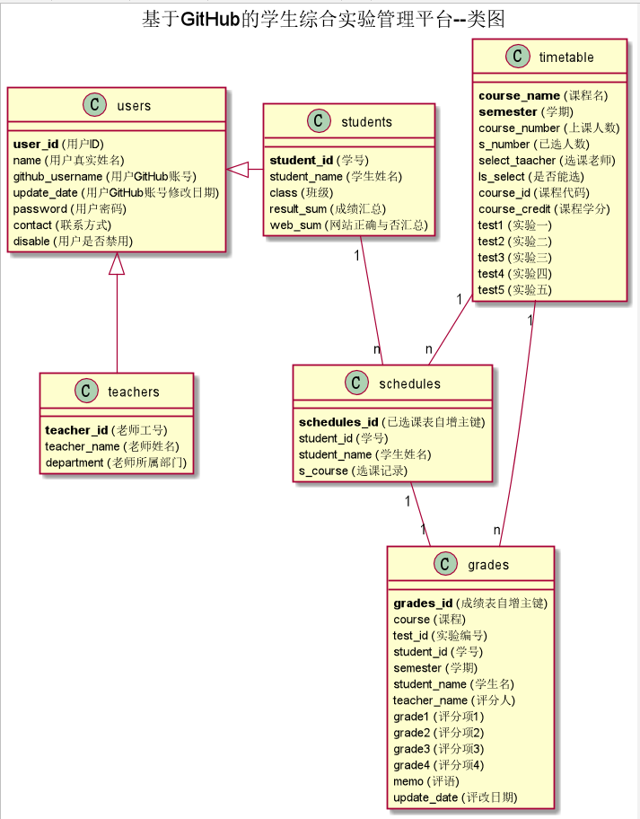

## 实验6 期末考核
# 基于GitHub的综合学生实验管理平台的设计

### 成都大学信息科学与工程学院

|学号|班级|姓名|
|:-------:|:-------------: | :----------:|
|201510414316|软件(本)15-3|王壮|

## 1. 概述
- 本系统一共设计了6张数据库表。除了原来的USER、TEACGER、STUDENT三张表之外，还有TIMETABLE（由课程名和学期作为联合主键的表
，一个学期和一门课程的组成的表单唯一，一条记录有上课人数、学分、教师（若教师未选此课，学生不能选择）、课程实验（根据学期的不同
而变化））、GRADE（主键是自增整数，每条记录有学号、评分人、课程、实验、实验的5项评分标准）、SCHEDULES（学生每次选课都会增加
一条记录）。
- 本系统在设计过程中就发现有逻辑严重bug，但由于各种原因也无法完美解决。。而且诸如接口方面的几乎不怎么懂，只能依瓢画葫芦。
- 基于GitHub的实验管理平台的作用是在线管理实验成绩的Web应用系统。学生和老师的实验内容均存放在GitHUB
页面上。总体设计在“多学期、多课程、多评分项”的基础上进行完善。
- 对于学生，一般而言多学期对于同一门课程只能修一次。
- 对于老师，一个学期的所有课程已经安排好，老师可以根据学期选择本学期课程授课。
- 学生的功能主要有：一是设置自己的GitHub用户名，二是查询自己的实验成绩，三是选课和查看课表，四是上传实验以及其他。
- 老师的功能主要有：一是批改并且维护每个学生的成绩，二是根据学期选择授课，三是上传实验、选出优秀作品，四是查看学生成绩以及其他等等。
- 老师和学生都能通过本系统的链接方便地跳转到学生的每个GitHUB实验目录，以便批改实验或者查看实验情况。
- 实验成绩分多项评分，按数字分数计算，每项实验的满分为100分，最低为0分。单次实验的总分就是多项的平均分。
- 系统自动计算每个学生的所有实验的平均分。
- 老师和学生作为GitHub用户的公共功能是修改密码，修改个人信息等等。
    
## 2. 系统总体结构

界面设计参见：https://angwz.github.io/is_analysis/test6/ui/index.html
    
## 3. 用例图设计 [源码](src/UseCase.puml)

## 4. 类图设计 [源码](src/class.puml)

## 5. 数据库设计
- ### [参见数据库设计](./DatabaseDesign.md)

## 6. 用例及界面详细设计
- ### [“登录”用例](./UseCase/登录.md),[界面](https://angwz.github.io/is_analysis/test6/ui/login.html)
- ### [“教师选课”用例](./UseCase/教师选课.md),[界面](https://angwz.github.io/is_analysis/test6/ui/teaselectcourse.html)
- ### [“查看课程库”用例](./UseCase/查看课程库.md),[界面](https://angwz.github.io/is_analysis/test6/ui/timetable.html)
- ### [“学生选课”用例](./UseCase/学生选课.md),[界面](https://angwz.github.io/is_analysis/test6/ui/stuselectcourse.html)
- ### [“学生列表”用例](./UseCase/学生列表.md),[界面](https://angwz.github.io/is_analysis/test6/ui/studentlist.html)
- ### [“查看课表”用例](./UseCase/查看课表.md),[界面](https://angwz.github.io/is_analysis/test6/ui/sechedules.html)
- ### [“发布实验”用例](./UseCase/发布实验.md),[界面](https://angwz.github.io/is_analysis/test6/ui/issuetest.html)
- ### [“实验列表”用例](./UseCase/实验列表.md),[界面](https://angwz.github.io/is_analysis/test6/ui/timetable.html)
- ### [“上传实验”用例](./UseCase/上传实验.md),[界面](https://angwz.github.io/is_analysis/test6/ui/uptest.html)
- ### [“评分和维护成绩”用例](./UseCase/评分和维护成绩.md),[界面](https://angwz.github.io/is_analysis/test6/ui/grade.html)
- ### [“查看成绩”用例](./UseCase/查看成绩.md),[界面](https://angwz.github.io/is_analysis/test6/ui/grade.html)
- ### [“优秀作品”用例](./UseCase/优秀作品.md),[界面](https://angwz.github.io/is_analysis/test6/ui/issuetest.html)
- ### [“修改密码”用例](./UseCase/修改密码.md),[界面](https://angwz.github.io/is_analysis/test6/ui/changepwd.html)
- ### [“修改GitHub信息”用例](./UseCase/修改GitHub信息.md),[界面](https://angwz.github.io/is_analysis/test6/ui/changemes.html)
- ### [“注销”用例](./UseCase/注销.md),[界面](https://angwz.github.io/is_analysis/test6/ui/logout.html)

    