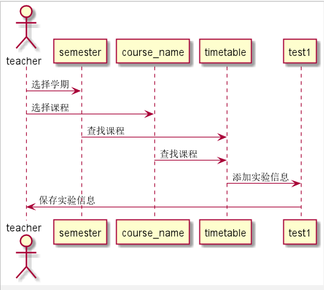

# “优秀作品”用例 [返回](../README.md)

## 1. 用例规约

|用例名称|登录|
|-------|:-------------|
|功能|优秀作品|
|参与者|教师、学生|
|前置条件|成功登录系统，选择优秀作品功能，选择课程，查看作品信息|
|后置条件|教师成功发布优秀作品；学生查看优秀的实验作品|
|主事件流| 1. 下拉框选择学期，选择课程 2.搜索出相应课程优秀作品|
|备选事件流|1a. 学生查看以前学期的课程  &nbsp;&nbsp; 1.成功查看优秀作品  2a.学生发布优秀作品  &nbsp;&nbsp; 1.成功查看，但不能发布   &nbsp;&nbsp; 2.已教师身份登录发布 |

## 2. 业务流程（顺序图） [源码](../src/uptest.puml)
- 

## 3. 界面设计
- 界面参照: https://github.com/angwz/is_analysis/tree/master/test6/ui/issuetest.html
- API接口调用
    - 接口1：[getStudentTest](../api/getStudentTest.md)

## 4. 算法描述
 - 无

## 5. 参照表

- [TIMETABLE](../DatabaseDesign.md/#TIMETABLE)