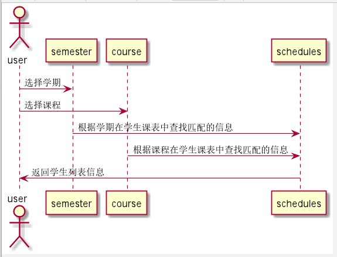

# “学生列表”用例 [返回](../README.md)

## 1. 用例规约

|用例名称|登录|
|-------|:-------------|
|功能|学生列表|
|参与者|教师、学生|
|前置条件|成功登录系统，选择课程和学期|
|后置条件|查看对应课程的学生列表和GitHub用户名|
|主事件流| 1. 用户登录系统 2.选择学期和课程 3.查看对应课程的学生列表和GitHub用户名 |
|备选事件流|无|

## 2. 业务流程（顺序图） [源码](../src/stulist.puml)
- 

## 3. 界面设计
- 界面参照: https://angwz.github.io/is_analysis/ui/studentlist.html
- API接口调用
    - 接口1：[getStudentInfo](../api/getStudentInfo.md)

## 4. 算法描述
 - 在schedules表通过学期和课程查找所以匹配学生。

## 5. 参照表

- [SCHEDULES](../DatabaseDesign.md/#SCHEDULES)