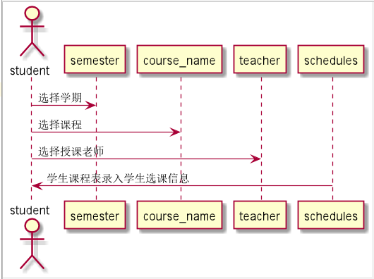

# “学生选课”用例 [返回](../README.md)

## 1. 用例规约

|用例名称|登录|
|-------|:-------------|
|功能|学生选课|
|参与者|学生|
|前置条件|学生成功登录系统，选择选课功能；选课已经老师选择|
|后置条件|成功进入选课功能页面|
|主事件流| 1. 下拉框选择学期，选择分类，选择未选课程，查找课程 2.搜索出相应课程信息，勾选相应课程 3.系统将学生信息和课程信息添加到相应学生课表中
|备选事件流|1a. 查看以前学期的课程  &nbsp;&nbsp; 1.提示不能选择   &nbsp;&nbsp; 2.重新提交学期  2a.学期为当学期，但是课程选择人数已满  &nbsp;&nbsp; 1.该课已满   &nbsp;&nbsp; 2.重新选择未满课程 |

## 2. 业务流程（顺序图） [源码](../src/StuSelectCourse.puml)
- 

## 3. 界面设计
- 界面参照: https://github.com/angwz/is_analysis/tree/master/test6/ui/stuselectcourse.html
- API接口调用
    - 接口1：[setSchedules](../api/setSchedules.md)

## 4. 算法描述
 - 在timetabl表中通过学期和课程名查找匹配可选课程。

## 5. 参照表

- [TIMETABLE（课程库表）](../DatabaseDesign.md/#TIMETABLE)
- [SCHEDULES（学生课表）](../DatabaseDesign.md/#SCHEDULES)