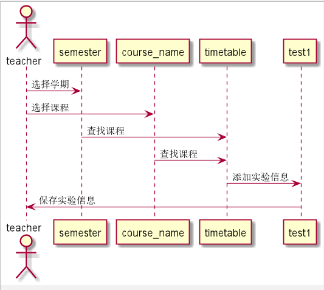

# “实验列表”用例 [返回](../README.md)

## 1. 用例规约

|用例名称|登录|
|-------|:-------------|
|功能|实验列表|
|参与者|学生|
|前置条件|学生成功登录系统，选择学期和课程|
|后置条件|成功查看当前学期课程的所有实验|
|主事件流| 1. 下拉框选择学期，选择课程，查找实验 2.搜索出相应实验信息|
|备选事件流|1a. 查看以前学期的课程  &nbsp;&nbsp; 1.提示不能选择   &nbsp;&nbsp; 2.重新提交学期  2a.学期为当学期，但是实验未布置  &nbsp;&nbsp; 1.该课未出现实验信息   &nbsp;&nbsp; 2.重新选择未被选课程 |

## 2. 业务流程（顺序图） [源码](../src/uptest.puml)
- 

## 3. 界面设计
- 界面参照: https://angwz.github.io/is_analysis/test6/ui/timetable.html
- API接口调用
    - 接口1：[getTimetableTest](../api/getTimetableTest.md)

## 4. 算法描述
 - 在timetable表中通过学期的课程名查找匹配课程实验。

## 5. 参照表

- [TIMETABLE（课程库表）](../DatabaseDesign.md/#TIMETABLE)