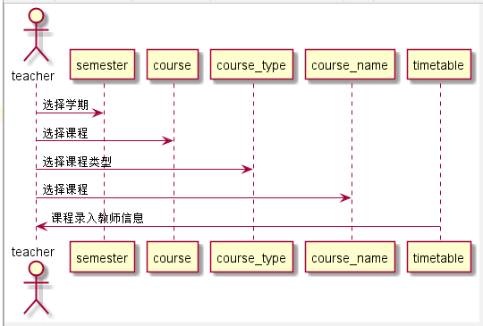

# “教师选课”用例 [返回](../README.md)

## 1. 用例规约

|用例名称|登录|
|-------|:-------------|
|功能|教师选课|
|参与者|教师|
|前置条件|教师成功登录系统，选择选课功能|
|后置条件|成功进入选课功能页面|
|主事件流| 1. 下拉框选择学期，选择分类，选择未选课程，查找课程 2.搜索出相应课程信息，勾选相应课程 3.系统将教师信息添加到相应课程中
|备选事件流|1a. 查看以前学期的课程  &nbsp;&nbsp; 1.提示不能选择   &nbsp;&nbsp; 2.重新提交学期  2a.学期为当学期，但是课程已被选  &nbsp;&nbsp; 1.该课已被选   &nbsp;&nbsp; 2.重新选择未被选课程 |

## 2. 业务流程（顺序图） [源码](../src/TeaSelectCourse.puml)
- 

## 3. 界面设计
- 界面参照: https://angwz.github.io/is_analysis/test6/ui/teaselectcourse.html
- API接口调用
    - 接口1：[setTimetable](../api/setTimetable.md)

## 4. 算法描述
 - 在timatable表中通过学期查找匹配结果进行选课。

## 5. 参照表

- [TIMETABLE（课程库表）](../DatabaseDesign.md/#TIMETABLE)