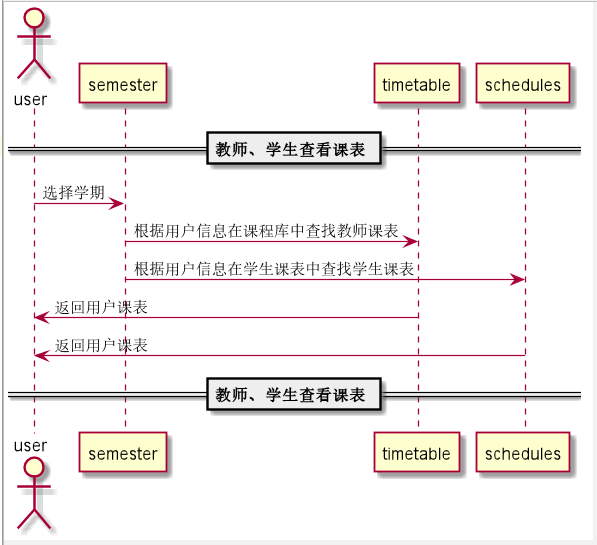

# “查看课程库”用例 [返回](../README.md)

## 1. 用例规约

|用例名称|登录|
|-------|:-------------|
|功能|查看课程库|
|参与者|教师、学生|
|前置条件|用户成功登录系统，选择选课功能，选择学期|
|后置条件|成功进入选课功能页面|
|主事件流| 1. 下拉框选择学期，选择分类，查找课程 2.搜索出相应课程信息|
|备选事件流| 无 |

## 2. 业务流程（顺序图） [源码](../src/schedules.puml)
- 

## 3. 界面设计
- 界面参照: https://angwz.github.io/is_analysis/test6/ui/timetable.html
- API接口调用
    - 接口1：[getTimetable](../api/getTimetable.md)

## 4. 算法描述
 - 无

## 5. 参照表

- [TIMETABLE（课程库表）](../DatabaseDesign.md/#TIMETABLE)
- [SCHEDULES（学生课表）](../DatabaseDesign.md/#SCHEDULES)