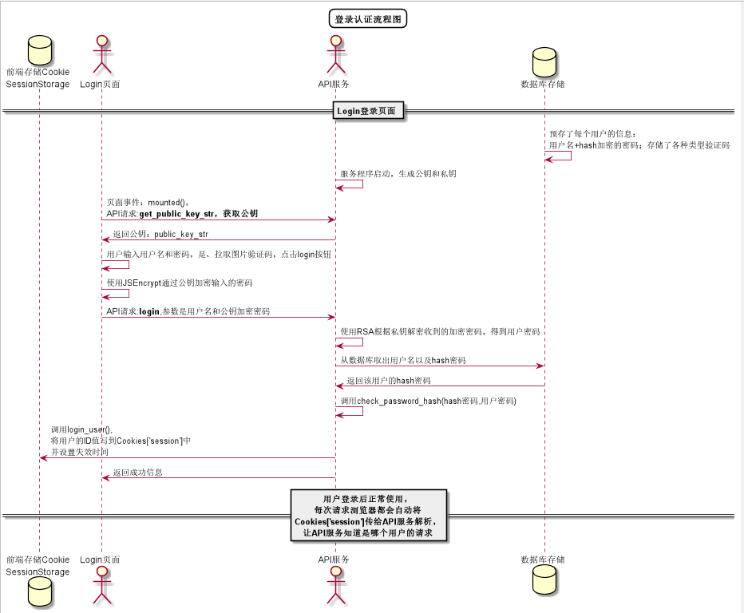

# “登录”用例 [返回](../README.md)

## 1. 用例规约

|用例名称|登录|
|-------|:-------------|
|功能|登录平台|
|参与者|访客|
|前置条件|访客在浏览器输入系统地址，进入系统登录页面|
|后置条件|登录成功后，跳转到主页|
|主事件流| 1. 访客输入用户名、密码和进度条验证码，选择用户类型 2.系统判断用户名，密码，用户类正确，允许登录 3.系统在客户端以Cookie形式存储登录用户信息，保持登录的持久性。|
|备选事件流|1a. 输入的用户名或者密码为空  &nbsp;&nbsp; 1.提示重新输入   &nbsp;&nbsp; 2.访客重新提交登录信息  2a.系统判断用户是否输入图片验证码，若不输出，则不允许登录  &nbsp;&nbsp; 1.提示输入验证码   &nbsp;&nbsp; 2.访客重新提交登录信息 3a.系统判断用户名，密码，用户类不正确，不允许登录  &nbsp;&nbsp; 1.提示重新输入   &nbsp;&nbsp; 2.访客重新提交登录信息 |

## 2. 业务流程（顺序图） [源码](../src/Login.puml)
- 

## 3. 界面设计
- 界面参照: https://github.com/angwz/is_analysis/tree/master/test6/ui/login.html
- API接口调用
    - 接口1：[login](../API/login.md)

## 4. 算法描述
 - 无

## 5. 参照表

- [USERS](../DatabaseDesign.md/#USERS)