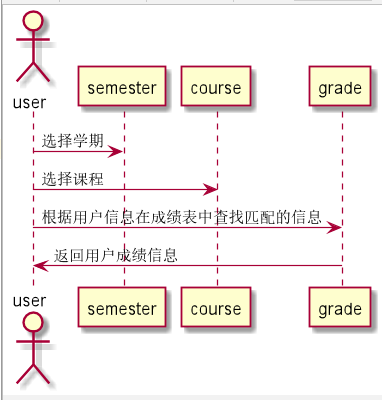

# “评分和维护成绩”用例 [返回](../README.md)

## 1. 用例规约

|用例名称|登录|
|-------|:-------------|
|功能|评分和维护成绩|
|参与者|教师|
|前置条件|成功登录系统，选择查看成绩功能，选择课程，查看实验，进行成绩操作|
|后置条件|教师改修完实验成绩，学生查看自己的成绩|
|主事件流| 1. 下拉框选择学期，选择课程 2.改修实验成绩的每一项，提交评语
|备选事件流|1a. 学生查看课程成绩  &nbsp;&nbsp; 1.成功查看   &nbsp;&nbsp; 2.学生不能修改   |

## 2. 业务流程（顺序图） [源码](../src/grade.puml)
- 

## 3. 界面设计
- 界面参照: https://github.com/angwz/is_analysis/tree/master/test6/ui/grade.html
- API接口调用
    - 接口1：[setGrade](../api/setGrade.md)

## 4. 算法描述
 - 在grade表中根据老师查找匹配结果进行成绩录入。

## 5. 参照表

- [GRADE](../DatabaseDesign.md/#GRADE)